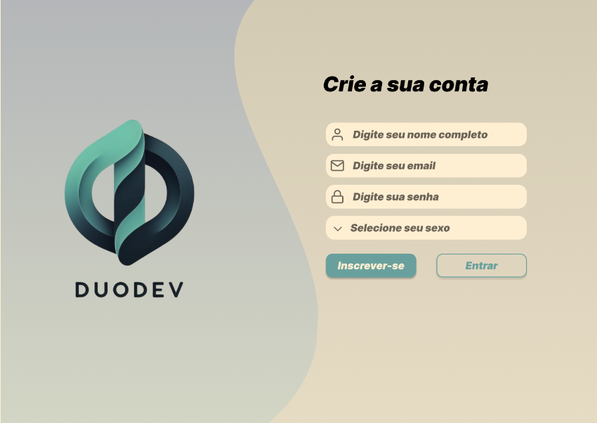
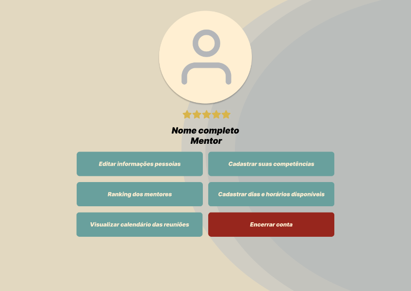
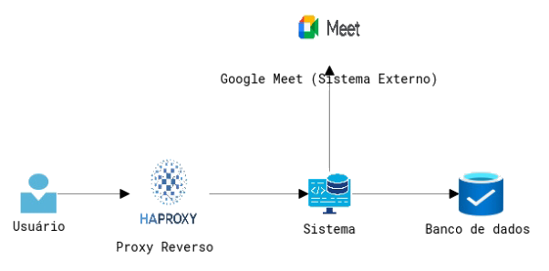
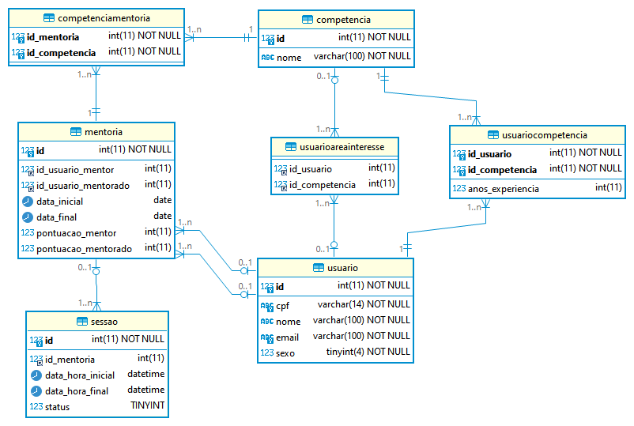

# DuoDev

[](https://github.com/wescaxeta/duodev-backend/actions/workflows/ci.yml)


Plataforma de **mentoria entre desenvolvedores**: conecta mentores e mentorados por competências
técnicas, agenda sessões com link do **Google Meet** e mantém um ranking pelas avaliações recebidas.

Projeto Integrador do 6º período de **Análise e Desenvolvimento de Sistemas (PUC Goiás, 2024/1)**,
desenvolvido em equipe com processo de engenharia de software completo: especificação de requisitos,
documento de design e arquitetura, gerência de configuração e de qualidade.

<p align="center">
  
  
</p>

## Funcionalidades

- Cadastro e login de usuários, com recuperação de senha por **token enviado por e-mail**
- Perfis de **mentor** e **mentorado**, com competências técnicas, anos de experiência e áreas de interesse
- Busca de mentores por competência
- Agendamento de sessões: convite por e-mail e criação do evento no **Google Calendar com link do Meet**
- Avaliação das mentorias e **ranking** de mentores e mentorados

## Arquitetura

| Visão geral | Modelo de dados |
|---|---|
|  |  |

- **Backend** ([`backend/`](backend)): API REST em Java 17 + Spring Boot 3 (Web, Data JPA, Validation, Mail),
  organizada em camadas `controller → service → repository`, com PostgreSQL e Flyway
- **Frontend** ([`frontend/`](frontend)): HTML, CSS e JavaScript puro, consumindo a API via `fetch`, servido por Nginx
- **Integrações**: Google Calendar API (OAuth 2.0) para criar as reuniões no Meet, e SMTP do Gmail para os e-mails
- **Infra**: Docker em cada parte; em produção, a equipe usou PostgreSQL gerenciado (AWS RDS) e HAProxy como proxy reverso

### Principais endpoints

| Recurso | Endpoints |
|---|---|
| Usuários | `POST /usuario/register` · `GET/PUT/DELETE /usuario/{id}` · `POST /usuario/resetarSenha` |
| Autenticação | `POST /login` · `POST /generateToken` · `GET /checkToken/{token}` |
| Competências | `GET/POST /competencia` · `GET /competencia/usuario/{idUsuario}` |
| Mentorias e sessões | `GET/POST /mentoria` · `POST /sessao` · `GET /sessao/aceitar/{inviteId}` |
| Ranking | `GET /ranking/mentores` · `GET /ranking/mentorados` |

## Como rodar

Requisito: Docker.

```bash
git clone https://github.com/wescaxeta/duodev-backend.git
cd duodev-backend
cp .env.example .env   # opcional: credenciais SMTP para envio de e-mails
docker compose up --build
```

- Frontend: http://localhost
- API: http://localhost:8080 (health check em `/actuator/health`)

A criação de reuniões no Google Meet exige credenciais OAuth próprias (`backend/src/main/resources/credentials.json`),
que **não são versionadas**. Sem elas, o restante do sistema funciona normalmente.

## Equipe

- Cauê Antônio Gomes de Oliveira
- Gabriel Camargo Moreira Ribeiro Camelo
- Paulo Ricardo Sales Araújo
- Rafael Roveri de Castro Mendes
- Weslley Silva Caxeta

## Observação

Este repositório reúne o backend e o frontend, que originalmente ficavam em repositórios separados.
Os primeiros commits são da versão inicial do backend; a versão final do projeto foi adicionada depois.
Antes da publicação, todas as credenciais (banco de dados, SMTP e OAuth do Google) foram retiradas
do código e substituídas por variáveis de ambiente.
